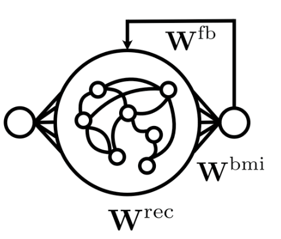

# rnn-learning
Mixing and matching biologically plausible learning rules for vanilla RNNs

-----
The general structure of the `simulation` class, and probes/monitors in particular, are directly inspired by Owen Marschall's repo https://github.com/omarschall/vanilla-rtrl/

The implementation for the RFLO algorithm is inspired by Murray 2019 "Local online learning in recurrent networks with random feedback" (see https://github.com/murray-lab/rflo-learning for more details)
